[앞선 글](https://woka-inc.github.io/deep%20learning%20기초/2024/12/09/ANN-2.html)에서 알아본 전통적인 인공 신경망은 데이터 속 패턴을 학습해 새로운 값을 예측해 낼 수 있습니다. 순전파를 통해 임의의 가중치로 모델의 예측값을 계산해 내고, 역전파를 통해 예측값과 정답 사이의 오차를 줄이는 방향으로 가중치를 업데이트했습니다. 이 모든 과정이 데이터의 패턴을 가장 잘 나타내는 가중치를 찾아내는 학습이었죠. 하지만 이 전통적인 인공 신경망은 순서가 있는 **순차 데이터(sequential data, 이하 시퀀스 혹은 시퀀스 데이터)**를 학습하기에 적합하지 않습니다. 이번 글에서는 이 시퀀스를 다루는 시퀀스 모델 중 가장 기본적인 인공신경망 모델인 **순환 신경망(Recurrent Neural Network, 이하 RNN)**을 전통적인 ANN과 비교하며 알아보고, tensorflow로 간단히 구현한 후, 어떤 한계가 남아있는지 소개하겠습니다.

## 대표적인 순차 데이터, 자연어

시퀀스 데이터에는 여러 가지가 있습니다. 우리가 하는 말인 자연어, 소리를 표현한 음파, 주식 거래량, 교통량 등처럼 같은 유형의 값이 나열되어 있지만 값의 순서에 따라 그 의미가 달라지는 데이터들을 **순차 데이터 혹은 시퀀스**라고 합니다. 그중에서도 시간의 흐름에 따라 의미가 존재하는 데이터는 **시계열 데이터(time-series data)**라고 합니다.

여러 유형의 순차 데이터가 있지만, 오늘 RNN을 설명하면서 다룰 순차 데이터는 바로 자연어입니다. 자연어는 사람이 일상에서 쓰는 언어로, 같은 단어도 그 의미가 애매하거나 유연하다는 특징이 있습니다. 컴퓨터에 명령을 내릴 때는, 0과 1만 이해할 수 있는 컴퓨터와 사람이 소통하기 위한 문법의 일종인 고급 프로그래밍 언어를 사용해 오고 있습니다. 만약 컴퓨터가 사람의 언어인 자연어를 이해한다면 고급 프로그래밍 언어를 배우지 않은 사람도 컴퓨터에 다양한 작업을 지시할 수 있겠죠? 이를 가능하게 하는 기술을 연구하는 분야를 **자연어 처리(Natural Language Processing, NLP)**라고 합니다.

자연어 처리에서는 다양한 **언어 모델(Language Model)**이 활용됩니다. 언어 모델은 단어 시퀀스인 문장의 확률을 계산합니다. 이 확률은 해당 문장이 적당히 자연스러워서 실제로 일어날 확률을 뜻합니다. 예를 들어 “No pain no gain.”이라는 문장의 확률은 0.7, “No pain spooky red.”라는 문장이 일어날 확률은 0.01입니다. “No pain” 뒤에 이어질 내용으로 “no gain”과 “spooky red”라는 후보 문장을 만든 후, 더 높은 확률을 가진 문장을 출력하는 거죠.

언어 모델에서 단어를 처리하기 위해서는 단어를 **벡터(vector)**로 표현해야 합니다. 벡터는 컴퓨터가 이해할 수 있는 숫자로 구성되어 있죠. 단어를 벡터로 표현하는 방법에는 여러 가지가 있습니다. 가장 기본적인 방법의 하나는 단어 집합의 크기만큼 벡터 차원을 설정하고, 표현하려는 단어의 인덱스에는 1을, 나머지에는 0을 할당하는 **원-핫 인코딩(one-hot encoding)**입니다.

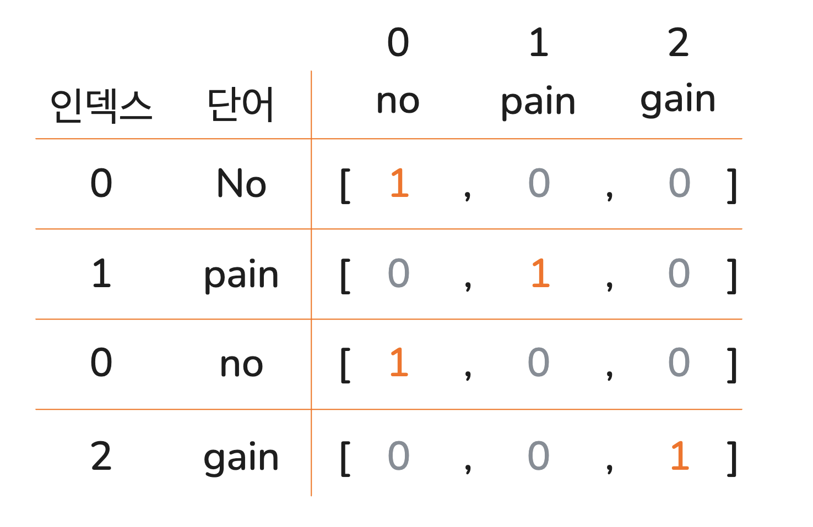{:width='400'}
<p class='img_caption'>No pain no gain의 원-핫 인코딩</p>

위 그림에서처럼 *No pain no gain*의 *pain*은 [0, 1, 0]으로 원-핫 인코딩 될 수 있습니다.

하지만 이 방법은 단어 간의 의미적 관계를 반영하지 못한다는 한계가 있습니다. 우리가 새로운 단어를 공부할 때 그 단어가 사용되는 여러 문장을 접하면서 단어의 의미를 구체화해 나가는 것처럼, 컴퓨터도 서로 다른 단어가 언제 함께 사용되는지, 혹은 의미상으로 유사한지 정도를 파악하면 그 단어를 보다 잘 이해하고 사용할 수 있습니다. 

이 아이디어를 토대로 단어의 의미를 충분히 반영해 다차원 공간에 벡터화하는 것을 **단어의 분산 표현(distributional representation)**이라고 하며, 이 과정을 **단어 임베딩(word embedding)**이라고 합니다.

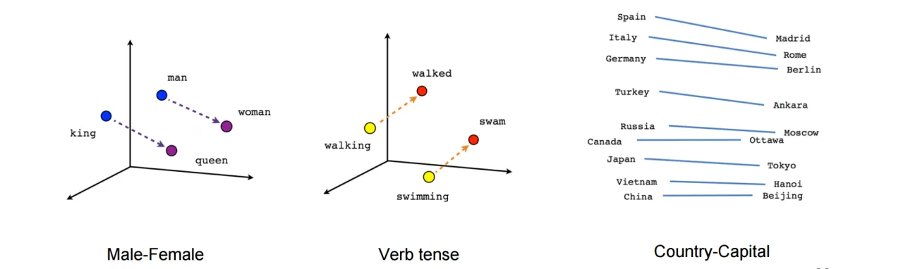{:width='800'}
<p class='img_caption'>단어 임베딩
    <a class='img_ref' href='https://medium.com/artists-and-machine-intelligence/ami-residency-part-1-exploring-word-space-andprojecting-meaning-onto-noise-98af7252f749'>(출처)</a>
</p>

단어를 의미적으로 벡터화하면, 위 그림에서처럼 유사한 관계를 가진 단어 쌍들이 비슷한 방향성을 나타냅니다. 예를 들어, *man*에서 *woman*으로 향하는 벡터와 *king*에서 *queen*으로 향하는 벡터가 유사한 패턴을 보이는 것처럼요. 

RNN이 학습하는 데이터는 이러한 분산 표현으로 변환된 단어 벡터들로 구성됩니다. 이번 글에서는 RNN이 학습할 자연어 단어들이 단어 임베딩 과정을 거쳐 분산 표현 벡터로 모델에게 전달된다는 점을 이해하는 데 집중하며, 단어 임베딩의 구체적인 구현 방법은 추후 자연어 처리를 따로 다루며 자세히 설명하겠습니다.

## RNN의 구조
앞서 배운 ANN은 feed forward 신경망입니다. Feed forward는 입력층부터 출력층까지 모델의 순전파 과정이 한 방향으로만 진행되는 방식을 뜻합니다. RNN과 feed forward ANN의 구조를 비교해 보면 왜 RNN이 문장 학습에 더 적합한지 그 이유를 알 수 있습니다.

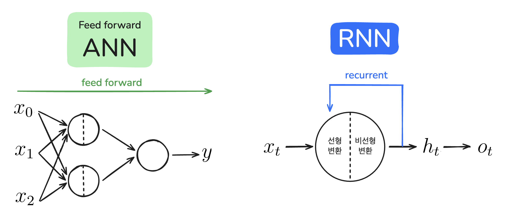{:width=''}
<p class='img_caption'>RNN과 feed forward ANN</p>

RNN의 'R'은 '되풀이되는'이라는 뜻을 가진 *recurrent*의 약자입니다. 모델의 데이터 흐름이 한 방향만을 가리키는 feed forward ANN과 달리 RNN에서는 *recurrent*를 보여주는 화살표가 있죠. 여기서 $t$는 time(특정 시점)을 의미합니다. N개의 순서가 있는 데이터를 입력한다면 $t$는 0부터 N-1까지 데이터를 순차적으로 할당받고, 매번 동일한 뉴런을 순환하며 데이터를 처리합니다.

RNN의 가장 큰 특징은 그림처럼 하나의 뉴런을 순환하는 구조를 가지고 있다는 점입니다. RNN의 순환 구조를 돌돌 말린 김밥을 펼치듯 펼쳐 전체 구조(full network)를 보여주는 것을 **unfold**라고 합니다.

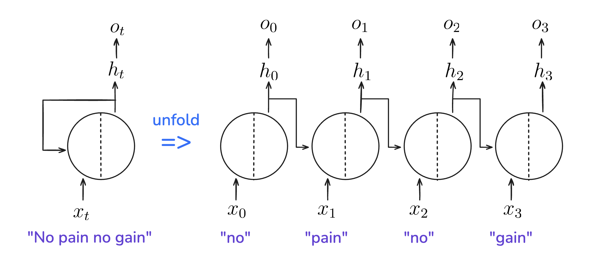{:width=''}
<p class='img_caption'>"No pain no gain"을 입력받는 RNN 펼치기</p>

앞서 살펴본 RNN의 순환구조를 반시계 방향으로 90도 돌린 후 펼친 그림입니다. 펼치기 전 $x_t$, $h_t$, $o_t$는 $t$ 시점의 값을 나타냈습니다. *No pain no gain*이라는 문장을 입력받는다면, 이 RNN을 펼쳤을 때 각 단어에 대해 순환하므로 총 4번의 순환이 진행됩니다.

### $x_t$: $t$ 시점의 입력값

$x$는 ANN에서와 같이 입력값을 나타냅니다. $x_t$는 t시점에서의 입력값이죠. 입력값이 자연어인 경우에는 t번째 단어의 분산 처리 벡터가 입력됩니다. 예를 들어 모델에 *No pain no gain*이라는 문장을 입력하면, $x_t$에는 4개 단어의 분산 처리 벡터가 순서대로 들어가게 됩니다. 펼친 구조로 표현하면 $x_0$와 $x_2$는 *no*의 분산 처리 벡터를, $x_1$와 $x_3$는 각각 *pain*과 *gain*의 분산 처리 벡터를 나타냅니다.

### $h_t$: $t$ 시점의 은닉 상태

$h_t$는 이전 단계의 은닉 상태인 $h_{t-1}$과 현 단계의 입력값인 $x_t$로 계산합니다. 즉, 이전 단계까지 누적 처리된 정보와 현 단계의 입력 정보를 합쳐서 현 단계까지 누적된 정보를 담게 되죠. 현재까지의 ‘상태’를 표현하기 때문에 **은닉 상태(hidden state)**라고 부릅니다. 그리고 처음부터 현재까지의 정보를 기억하는 것과 마찬가지이므로 모델의 **메모리(memory)**에 해당하기도 합니다.

Feed forward ANN에서 $x_0$, $x_1$, $x_2$의 순서를 바꿔도 출력되는 예측값은 그대로입니다. 그러나 값이 순차적으로 입력되는 RNN의 입력 $x_t$는, 어떤 값이 어떤 순서로 들어가느냐에 따라 출력되는 예측값이 달라집니다. $h_t$를 계산할 때 이전 데이터에 대한 정보가 반영되기 때문입니다.

### $o_t$: $t$ 시점의 출력값

$o_t$는 $h_t$를 처리해서 출력하는 예측값입니다. 예를 들어 *no*에 대한 정보가 담긴 $h_0$와 *pain*의 분산 처리 벡터인 $x_1$의 정보를 합쳐 $h_1$를 계산해 낸 후, *no pain* 다음으로 나올 단어를 예측한 값이 $o_1$인 것이죠. $o_t$는 모든 RNN 모델에 필수적인 값은 아닙니다. 영화 리뷰에서 사람들의 반응을 긍정 혹은 부정으로 판단하고 싶을 때, 우리는 리뷰 속 단어의 다음에 나올 단어를 예측하기보다는 문장 전체에 대한 출력이 필요하기 때문입니다.


## RNN vs feed forward ANN

Feed forward ANN과 RNN의 구조를 비교해 알 수 있는 RNN의 주요 특징은 다음과 같습니다.

<br>
> 1) 직전 입력의 순차적 처리 정보가 반영된다.

Feed forward ANN에서는 입력값의 순서가 예측값에 영향을 미치지 않았던 반면, RNN에서는 입력값이 들어오는 순서대로 은닉 상태가 업데이트되기 때문에, 순서가 있는 순차적 데이터를 처리하는 데에 적합합니다.

<br>
> 2) 하나의 뉴런을 순환하므로 같은 가중치를 공유한다.

ANN에서 우리는 신경망의 깊이가 깊어질수록 각 뉴런에 필요한 가중치들을 각각 고려해야 했습니다. 각 입력과 가중치 곱의 합을 수식 $\sum_{i=1}^{m}x_iw_i$로 표현했던 것처럼, 각 입력값에 대응하는 가중치가 여러 개 필요했었죠. 그러나 RNN은 하나의 뉴런을 반복해서 순환하기 때문에, 순차적으로 들어오는 입력값들은 동일한 가중치와 곱해집니다. 따라서 입력 데이터의 길이가 길어져 신경망의 깊이가 깊어지더라도 동일한 가중치를 사용하게 됩니다.

<br>
> 3) 입력 길이가 가변적이다.

ANN 모델을 구현할 때는 몇 개의 입력 노드를 사용할 건지 모델 초기화 단계에서 미리 지정해야 했습니다. 따라서 100개의 입력노드를 가진 ANN 모델은 100개의 입력값만 받을 수 있었죠. 하지만 RNN은 입력 길이가 길어져도 (즉, 문장의 길이가 길어져도) 모델을 구성하는 뉴런을 그대로 사용하고, 순환 횟수만 늘려주면 되기 때문에 가변적인 길이의 입력값을 넣을 수 있습니다.

## RNN의 학습

RNN을 펼쳐보면 여러 뉴런이 겹쳐 있는 인공신경망과 유사합니다. 따라서 RNN도 ANN과 마찬가지로 순전파와 역전파를 반복하며 학습합니다. 다만, 순환 구조로 인해 학습 과정에서 차이가 생깁니다. 이번에는 RNN의 순전파와 역전파가 어떻게 진행되는지 살펴보겠습니다.

### 순전파

반복 순환되는 RNN의 뉴런 내부 과정을 살펴보면 feed forward ANN과 비슷합니다. 선형 변환과 비선형 변환을 차례대로 거치죠.

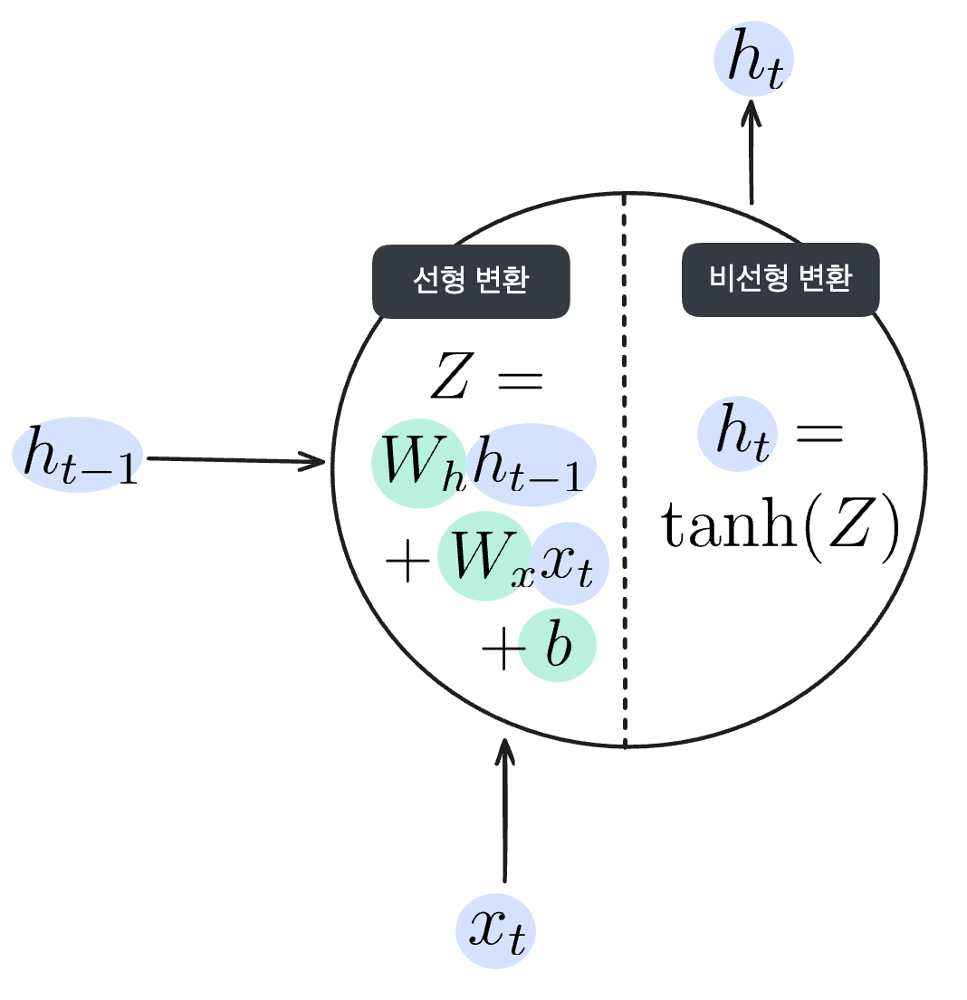{:width=''}
<p class='img_caption'>RNN 순전파의 선형, 비선형 변환</p>

위 그림처럼 입력값($x_t$)과 직전 뉴런의 은닉상태($h_{t-1}$)가 입력되면 가중치와 편향을 계산해 선형 변환을 실시합니다.

$$Z = W_x x_t + W_h h_{t-1} + b$$

입력되는 $x_t$와 $h_{t-1}$에 해당하는 가중치를 각각 곱해주고 편향을 더해주는, feed forward ANN에서도 볼 수 있었던 선형 변환입니다. 여기서는 선형 변환된 값을 $Z$라고 하겠습니다.

이후 선형 변환된 값 $Z$에 비선형 변환 처리를 한 값이 $h_t$가 됩니다. 비선형 변환을 구현하기 위해 활성화 함수를 사용했던 것, 기억나시나요? 이번에 사용할 활성화 함수는 **쌍곡선 함수**라고도 불리는 **hyperbolic tangent 함수(이하 tanh 함수)**입니다.

$$h_t = \textrm{tanh}(Z)$$

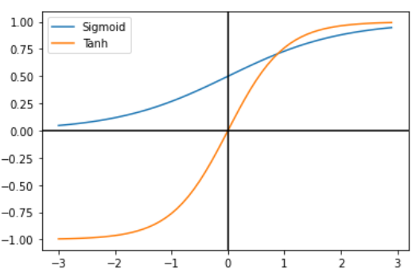{:width='350'}
<p class='img_caption'>논문 <<em>The Most Used Activation Functions: Classic Versus Current</em>></p>

두 함수의 그래프를 비교해 보면 알 수 있듯, tanh 함수는 sigmoid 함수와 유사한 양상을 띠고 있습니다. 다만 sigmoid 함수의 출력값은 0과 1 사이인 반면, tanh 함수의 출력값은 -1과 1 사이입니다. 

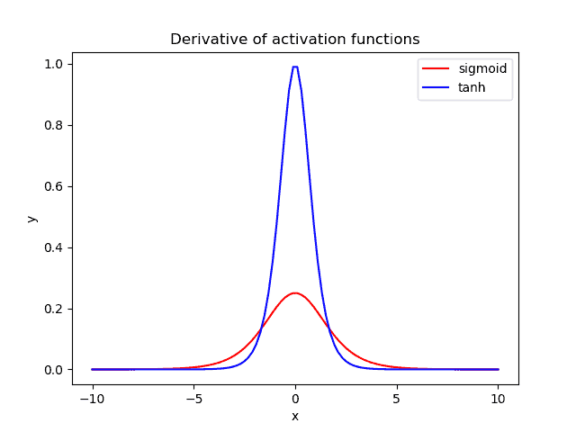{:width='380'}
<p class='img_caption'>tanh 함수와 sigmoid 함수의 도함수 비교
    <a class='img_ref' href='https://www.baeldung.com/cs/sigmoid-vs-tanh-functions'>(출처)</a>
</p>

두 함수의 미분 그래프를 비교해 보면 tanh 함수가 가질 수 있는 기울기(미분값)의 폭이 더 넓습니다. sigmoid 함수의 미분 최댓값은 0.3, tanh 함수의 미분 최댓값은 1입니다. 덕분에 tanh 함수는 기울기 소실 증상이 더 적은 편입니다.

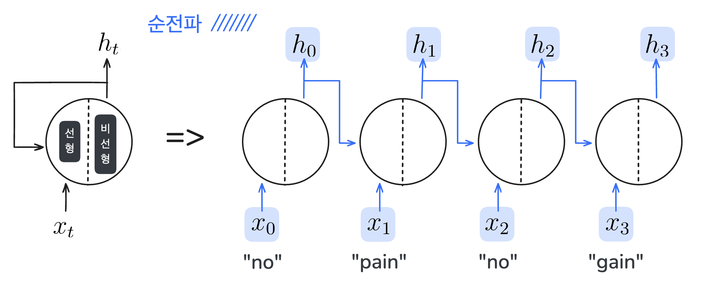{:width=''}
<p class='img_caption'>RNN의 순전파</p>

펼친 RNN은 여러 뉴런이 겹쳐있는 인공 신경망으로 볼 수 있다고 했습니다. 따라서 인공 신경망의 학습과 같은 순서로 순전파를 먼저 수행해 임의의 가중치에 대한 예측값을 출력합니다.

### 역전파, BPTT(Backpropagation Through Time)

그런 다음, 정답과의 오차를 줄이기 위해 손실 함수로 계산한 오차를 역전파합니다. 이때, RNN에서의 역전파는 시간(혹은 순서)을 거슬러 가기 때문에 **Backpropagation Through Time(BPTT)**라고 부릅니다.

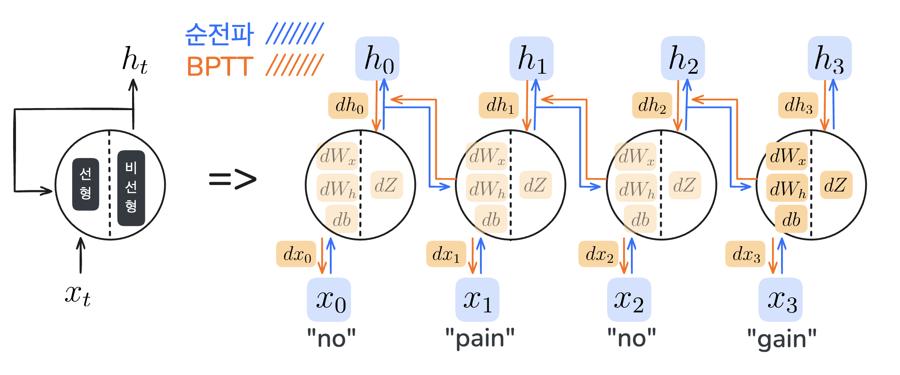{:width=''}
<p class='img_caption'>RNN의 순전파와 BPTT</p>

Feed forward ANN에서도 그랬듯, 손실에 대한 가중치의 미분인 $\frac{dL}{dW_x}$와 $\frac{dL}{dW_h}$를 구할 때는 미분의 연쇄 법칙을 따릅니다. 순환 구조의 RNN에서 보면 다음과 같습니다.

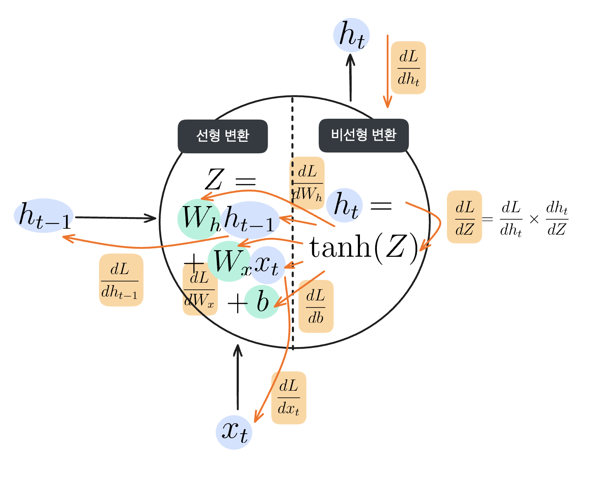{:width=''}
<p class='img_caption'>RNN에서 미분의 연쇄법칙</p>

다소 복잡해 보이지만, 미분의 연쇄법칙을 통해 결국 손실에 대한 $W_x$, $W_h$, $h_{t-1}$, $x_t$의 기울기를 모두 구할 수 있다는 것을 기억하세요.

### Truncated BPTT
RNN에서는 역전파를 계산할 때, 중간에 계산된 값인 $h_t$를 보관해야 합니다. 이때, 입력되는 데이터가 너무 길어져 RNN의 깊이가 깊어지면, 보관해야 하는 $h_t$의 수가 많아집니다. 데이터를 보관하고 연산 처리하기 위한 컴퓨팅 자원이 증가하게 되죠. 뿐만아니라 미분의 연쇄법칙으로 인해 기울기가 누적되다 보니, 최종 출력에서 멀어질수록 계산된 기울기가 너무 작아져 버리는 기울기 소실 문제도 일어납니다. 이를 해결하기 위해 큰 시계열 데이터를 다루는 RNN은 적당한 길이로 잘라서 역전파를 수행하는데, 이를 **Truncated BPTT**라고 합니다.

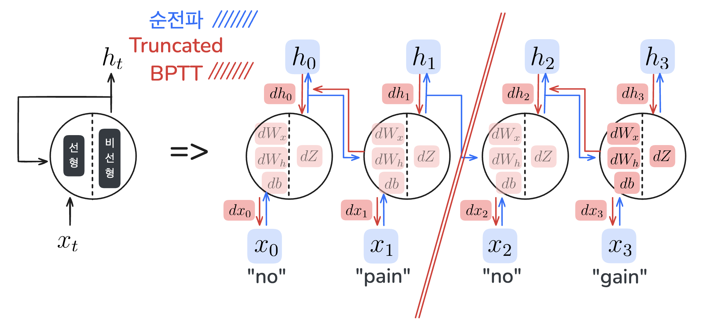{:width=''}
<p class='img_caption'>Truncated BPTT</p>

이때 중요한 것은, 신경망의 역전파만 자른다는 것입니다. 이렇게 하면 잘린 조각 내에서는 다른 조각들의 데이터를 반영하지 않고 오차와 기울기를 계산하기 때문에 기울기가 소실되거나, 누적된 이전 데이터를 보관할 메모리에 대한 걱정은 덜 수 있습니다.

## Tensorflow로 RNN 구현하기

오늘 우리가 알아본 RNN은 tensorflow의 API로 간단하게 구현할 수 있습니다. 먼저 필요한 라이브러리를 import하겠습니다.

```python
import numpy as np
import tensorflow as tf
from tensorflow.keras.models import Sequential
from tensorflow.keras.layers import Dense, SimpleRNN
```

첫 번째로, RNN 모델을 학습시킬 데이터를 만듭니다.

```python
X = np.random.rand(10, 5, 1)
y = np.random.randint(0, 2, size=(10, 1))
```

이번 예시에서는 1차원 벡터 5개로 구성된 입력 샘플 10개에 대해 0 또는 1로 이진 분류를 수행하려고 합니다.

따라서 입력 데이터인 `X`는 `(10, 5, 1)` 크기의 행렬로 준비하고, 정답인 `y`는 0 이상 2 미만의 정수로 `(10, 1)` 크기의 행렬로 준비합니다.

```python
model = Sequential([
    SimpleRNN(8, activation='tanh', input_shape=(5, 1)),
    Dense(1, activation='sigmoid')
])
```
두 번째로, tensorflow의 `SimpleRNN` API와 출력층이 되는 `Dense` API를 연결해 순차 모델인 RNN을 만듭니다.

이때, RNN 계층에서 은닉 상태 벡터는 8차원으로 임의 설정하고, 활성화 함수로 `tanh`를 사용했습니다. 출력층에서는 이진 분류를 위해 `sigmoid` 함수를 활성화 함수로 사용했습니다.

```python
model.compile(optimizer='adam', loss='binary_crossentropy', metrics=['accuracy'])
model.fit(X, y, epochs=20, verbose=1)
y_pred = model.predict(X)
print("\n예측값:\n", y_pred)
```

모델을 컴파일할 때 손실함수로 BCE(`binary_crossentropy`)를 사용했습니다.

`.fit()`메소드로 모델을 학습시킬 때, `epochs`를 `20`으로 설정해 학습을 20회 반복하도록 합니다.

학습이 완료된 후 `.predict()`메소드로 `X`에 대한 모델의 예측값을 출력합니다.

## RNN의 한계

Truncated BPTT로 역전파를 실행해도, 굉장히 긴 시계열 데이터가 입력되었을 때 RNN이 아주 오래 전의 정보는 제대로 기억하지 못한다는 문제는 여전합니다. Truncated BPTT는 계산 효율을 크게 증가시키지만 잘라진 구간 내부에서만 역전파를 수행하므로, 이전 구간에서의 정보를 충분히 반영하지 못할 가능성이 있습니다. 

{:width=''}
<p class='img_caption'>RNN 장기 의존성 문제
    <a class='img_ref' href='https://youtu.be/LHXXI4-IEns'>(출처)</a>
</p>

위 그림은 “What time is it?”이라는 문장의 각 단어를 순차적으로 입력할 때, RNN의 은닉상태가 어떻게 변화하는지를 보여주고 있습니다. 새로운 단어를 처리할 때마다, 이전의 은닉상태는 새로운 입력과 결합되면서 점점 희석됩니다. 처음 “What”이 입력되었을 때, 은닉 상태는 100% “What”에 대한 정보로 채워져 있지만, 이후 “time”, “is”, “it”, “?” 순으로 단어가 입력될수록 은닉 상태에서 “What”의 정보는 점차 줄어듭니다. 최종적으로 “?“를 입력할 때는 “What”에 대한 정보가 거의 남아 있지 않습니다.

이는 ANN에서 발생했던 기울기 소실 문제(Vanishing Gradient Problem)가 RNN에서도 나타나면서 일어나는 일입니다. ANN에서 알아봤던 기울기 소실 문제를 기억하시나요? 출력층에서 입력층으로 손실이 역전파될수록 미분의 연쇄법칙에 의해 도함수가 누적되어 곱해집니다. 이때 활성화 함수의 미분값이 0~1 사이이기 때문에 도함수가 누적될수록 기울기는 0에 가까워집니다. 역전파되는 기울기로 가중치의 값을 업데이트해야 하는데, 기울기가 0에 가까우니 입력층에 가까울수록 가중치는 업데이트되지 않는 것이죠. 

RNN에서도 마찬가지입니다. 순차 데이터에서 입력층에 가까운 데이터는 비교적 ‘과거’에 해당하는 정보일 것입니다. RNN의 가중치에 과거의 정보가 학습되지 않으니, 새로운 단어를 예측할 때 과거의 정보는 반영하기 어려워집니다.

{:width='400'}
<p class='img_caption'>장기 의존성 문제 예문</p>

위 문장에서 파란 빈칸에 들어갈 단어를 <span style="color:#1c70ff">Korean</span>으로 예측하려면, 문장 초반에 등장한 <span style="color:#ff6c00">Korea</span>라는 정보가 반영되어야 합니다. 하지만 문장이 길어질수록 <span style="color:#ff6c00">Korea</span>와 파란 빈칸 사이의 거리가 멀어지고, RNN은 <span style="color:#ff6c00">Korea</span>를 제대로 기억하지 못하게 됩니다. 이처럼 RNN이 과거의 정보를 충분히 학습하지 못하는 현상을 **장기 의존성 문제(Long-Term Dependency)**라고 합니다.

이러한 한계로 RNN은 먼 과거의 정보가 있어야 하는 문장 이해, 문맥 유지 등의 작업에서 한계를 가지게 됩니다. 이를 극복하기 위해 LSTM(Long Short-Term Memory)과 GRU(Gated Recurrent Unit)가 등장했습니다. 다음 글에서는 LSTM과 GRU가 어떻게 RNN의 구조를 개선하여 장기 의존성 문제를 해결하는지, 그 작동 원리와 장점을 알아보고 RNN과의 차이점을 살펴보겠습니다.